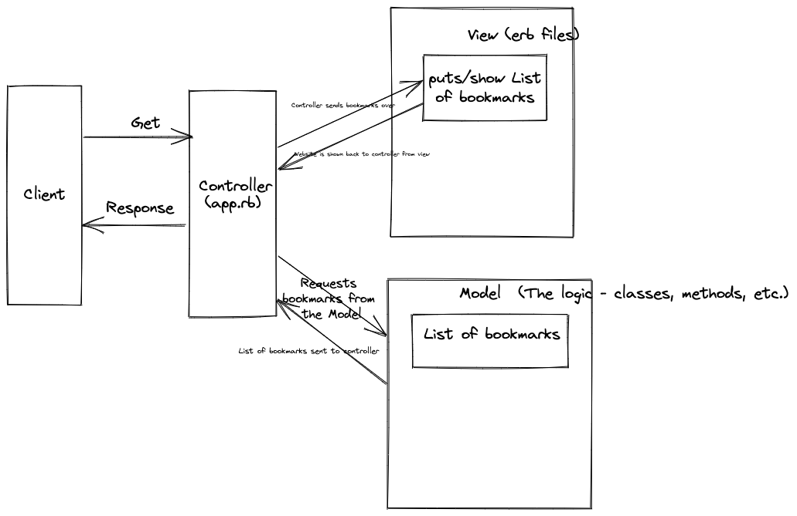

bookmark_manager specifications:

The website will have the following specifications:

Show a list of bookmarks
Add new bookmarks
Delete bookmarks
Update bookmarks
Comment on bookmarks
Tag bookmarks into categories
Filter bookmarks by tag
Users are restricted to manage only their own bookmarks

'''
User story:

As an internet user
In order to have quick access to websites I use frequently
I would like to access a list of website bookmarks
'''

'''
Domain Model:

https://github.com/Jaroslaw-Roman-Cudzich/bookmark_manager/blob/437e43787b7c5c953fba411c278a7e40cb92de14/bookmark_manager_domain_model.png

'''